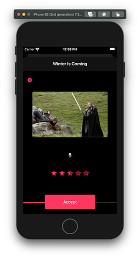
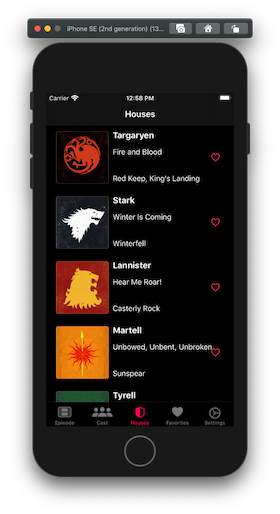

# Práctica de Fundamentos iOS

Aplicación basada en la popular serie Juego de tronos (_Game of Thrones_)

## Tecnologías

- Xcode
- Swift

  -- UI: XIB, AutoLayout, UITabBarController, UINavigationController, UITableView, UITableViewCell, etc

  -- JSON, JSONDecoder, Codable

  -- ARC weak, unowned, try catch, etc

  -- Generics, Protocols, Enum, Clousure, etc

  -- Design Patterns: MVC, Singleton, Delegate, NotificationCenter

## Especificaciones

- Lista de episodios mostrando su detalle al hacer tap sobre la celda.
- Lista de actores mostrando su detalle al hacer tap sobre la celda.
- Lista de casas mostrando su detalle al hacer tap sobre la celda.
- Toda la información mostrada será obtenida a partir de diferentes **json**.
- Episodios, Actores y Casas podrán ser seleccionados como _Favoritos_ por medio de un icono en forma de corazón, cambiando de hueco a relleno. Dicha selección de favoritos será mostrada en su correspondiente lista que deberá refrescarse automáticamente.
- Cada episodio puede ser valorado de 0 a 5 estrellas por medio del botón _Rate_.
- Mostrar en la pantalla _Settings_ un par de botones para poder eliminar reviews y favoritos, lógicamente ello afectará al refresco de los elementos implicados.

##### Capturas de pantallas

